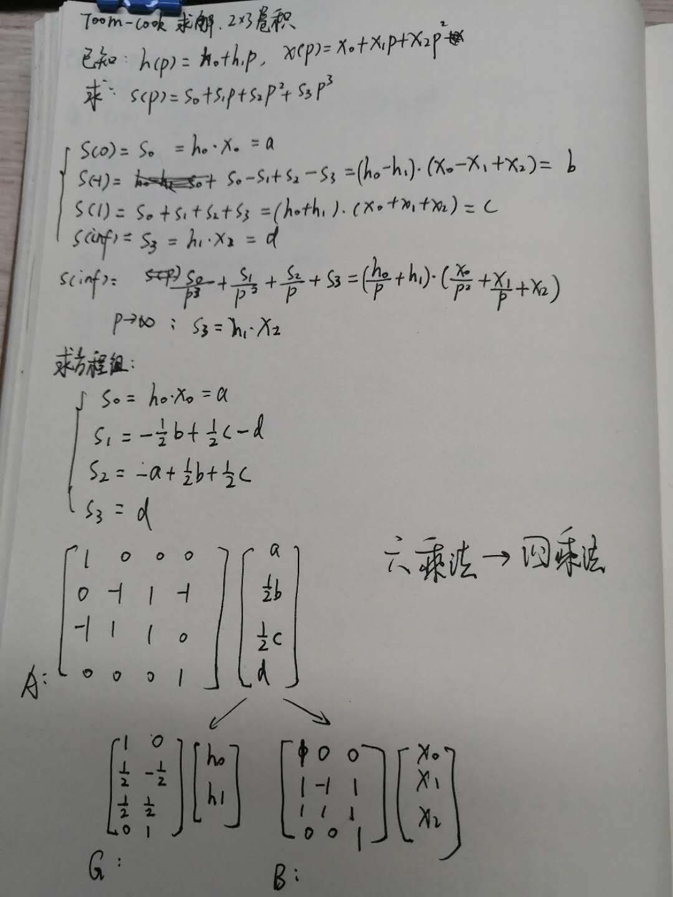
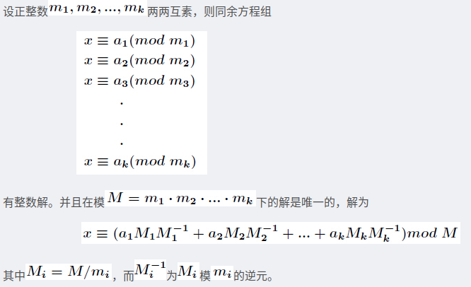
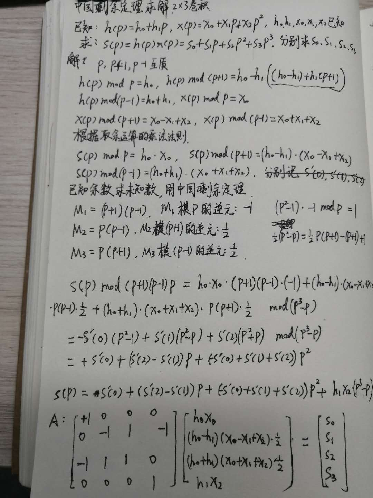

## 说明

代码用于理解winograd算法，简单实现。

winograd算法和strassen算法一样，思想上都是用更多的加法，用更少的乘法。

winograd乘法上的消耗减少了，内存IO上的耗时增加了，容易抵消乘法减少带来的收益。

## toom-cook

求解G、B、A

https://gmplib.org/manual/Toom-3_002dWay-Multiplication.html

## 中国剩余定理

https://www.encyclopediaofmath.org/index.php/Winograd_small_convolution_algorithm

