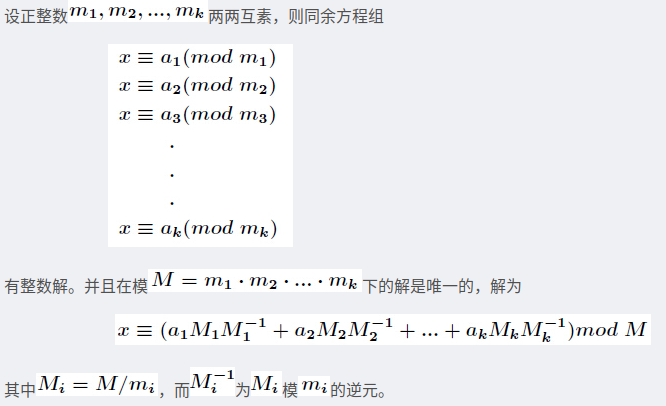
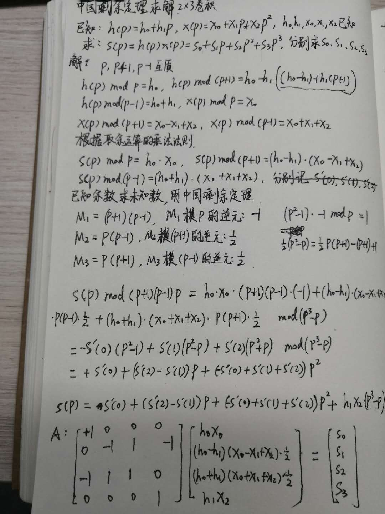
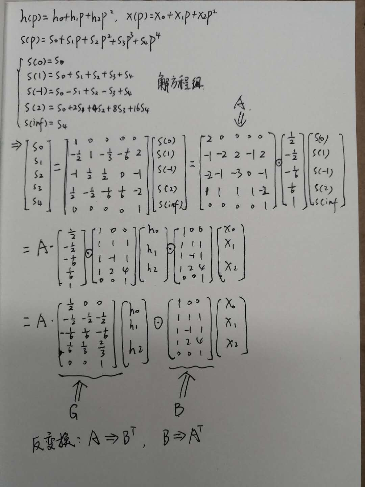

## 说明

代码用于理解winograd算法，简单实现。

winograd算法和strassen算法一样，思想上都是用更多的加法，用更少的乘法。

winograd乘法上的消耗减少了，内存IO上的耗时增加了，容易抵消乘法减少带来的收益。

## toom-cook

求解G、B、A

https://gmplib.org/manual/Toom-3_002dWay-Multiplication.html


## 中国剩余定理

https://www.encyclopediaofmath.org/index.php/Winograd_small_convolution_algorithm





## 思考

多项式乘法的本质是多项式系数的卷积。

一个域中的卷积可以等价为另一个域中的乘法。

G、A、B实际是到另一个域的变换矩阵，变换之后卷积就可以以乘法的方式体现。

卷积的本质是滤波。

滤波的本质是什么？有效信号的放大，无效信号的抑制，最终得到我们需要的信息。

## try again

https://github.com/andravin/wincnn

```python
>>> wincnn.showCookToomConvolution((0,1,-1,2),3,3)

AT = 
⎡1  1  1   1  0⎤
⎢              ⎥
⎢0  1  -1  2  0⎥
⎢              ⎥
⎣0  1  1   4  1⎦

G = 
⎡1/2    0     0  ⎤
⎢                ⎥
⎢-1/2  -1/2  -1/2⎥
⎢                ⎥
⎢-1/6  1/6   -1/6⎥
⎢                ⎥
⎢1/6   1/3   2/3 ⎥
⎢                ⎥
⎣ 0     0     1  ⎦

BT = 
⎡2  -1  -2  1   0⎤
⎢                ⎥
⎢0  -2  -1  1   0⎥
⎢                ⎥
⎢0  2   -3  1   0⎥
⎢                ⎥
⎢0  -1  0   1   0⎥
⎢                ⎥
⎣0  2   -1  -2  1⎦

FIR filter: AT*((G*g)(BT*d)) =
⎡d[0]⋅g[0] + d[1]⋅g[1] + d[2]⋅g[2]⎤
⎢                                 ⎥
⎢d[1]⋅g[0] + d[2]⋅g[1] + d[3]⋅g[2]⎥
⎢                                 ⎥
⎣d[2]⋅g[0] + d[3]⋅g[1] + d[4]⋅g[2]⎦
```



## 快速傅里叶变换

卷积还可以用快速傅里叶变换加速计算，参考fft.py